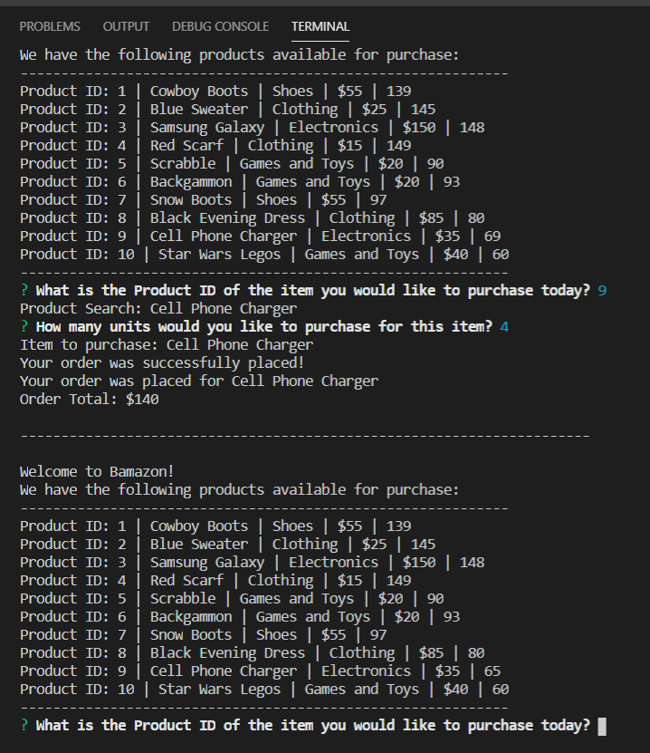

# Bamazon

Bamazon is a CLI App designed to allow a customer to purchase products from the Bamazon Store. When the bamazonCustomer.js file is run in Node, all available products are displayed on the screen and the customer can purchase an item.

## To run the Bamazon App

The Bamazon App allows the user to purchase an item from the products displayed. Once the customer chooses the product, they are prompted to select a desired quantity. After they finalize their purchase the total cost is dispalyed. The App then displays an updated product listing where the quantity is reduced by the amount of the last purchase.

## Built using Node.js and MySql:

To display the products that are avialable on Bmaazon the product data is retrieved by connecting to the Bamazon SQL databse.  

### User Controls -  

   * `  

